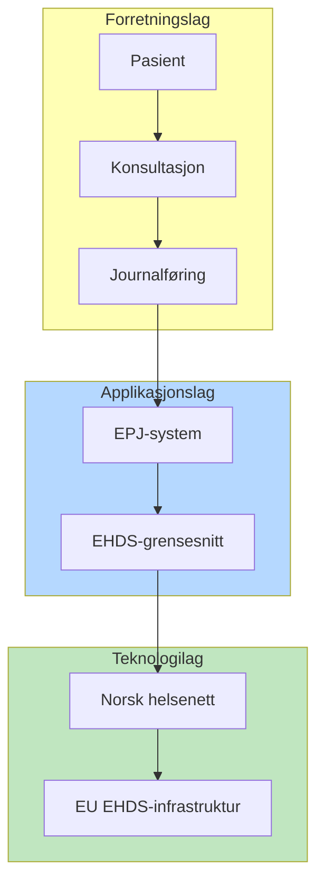

# ArchiMate-konsepter i Mermaid-diagrammer

## Mapping: ArchiMate-lag → Mermaid-syntaks

### Fargekonvensjoner per lag

| ArchiMate-lag | Farge | Hex | Bruk |
|---|---|---|---|
| Strategy | Lys rosa | `#F5DEB3` | Mål, kapabiliteter, ressurser |
| Business | Gul | `#FFFFB5` | Prosesser, aktører, tjenester |
| Application | Lyseblå | `#B5D8FF` | Komponenter, grensesnitt, data |
| Technology | Lysegrønn | `#C0E6C0` | Noder, infrastruktur, nettverk |
| Motivation | Lilla | `#D4B5FF` | Drivere, mål, krav, prinsipper |

### Elementtyper → Mermaid-notasjon

| ArchiMate-element | Mermaid-representasjon |
|---|---|
| Business Actor | Personfigur eller rektangel med gul bakgrunn |
| Business Process | Avrundet rektangel med gul bakgrunn |
| Business Service | Rektangel med avrundet topp, gul bakgrunn |
| Application Component | Rektangel med blå bakgrunn |
| Application Interface | Rektangel med strek på venstre side, blå |
| Application Service | Rektangel med avrundet topp, blå |
| Data Object | Rektangel med brettet hjørne, blå |
| Technology Node | 3D-boks eller rektangel, grønn bakgrunn |
| Infrastructure Service | Rektangel med avrundet topp, grønn |

## Architecture-beta syntaks (lagdelte visninger)

## Flowchart med ArchiMate-stil

## Relasjonstyper

| ArchiMate-relasjon | Mermaid-pil | Betydning |
|---|---|---|
| Composition | `--*` eller `-->` med label | "er del av" |
| Aggregation | `--o` eller `-->` med label | "grupperer" |
| Assignment | `-->` | "er tildelt" |
| Serving | `-->` med label "serves" | "betjener" |
| Flow | `-.->` | "flyt av informasjon/verdi" |
| Triggering | `==>` | "utløser" |
| Access | `-->` med label "reads/writes" | "aksesserer data" |
| Realization | `-->` stiplet | "realiserer" |

## Diagrammatisk resonnering

Bruk diagrammer aktivt som analyseverktøy, ikke bare dokumentasjon:
1. **Start med aktører og tjenester** – hvem gjør hva?
2. **Legg til applikasjoner** – hvilke systemer støtter prosessene?
3. **Vis dataflyt** – hvor går informasjonen?
4. **Identifiser gap** – mangler det forbindelser eller komponenter?

## Begrensninger

Mermaid kan **ikke** direkte uttrykke:
- ArchiMate viewpoints (men kan simuleres med subgraphs)
- Formelle ArchiMate-ikoner (bruk farger og former i stedet)
- Derived relations (vis kun eksplisitte relasjoner)
- Junction-elementer (bruk mellomliggende noder)

## Vanlige feil

- Blander farger vilkårlig uten å følge lagkonvensjoner
- Lager for komplekse diagrammer – del opp i flere visninger
- Glemmer å vise relasjoner mellom lag
- Bruker kun flowchart når architecture-beta gir bedre lagdelt visning
