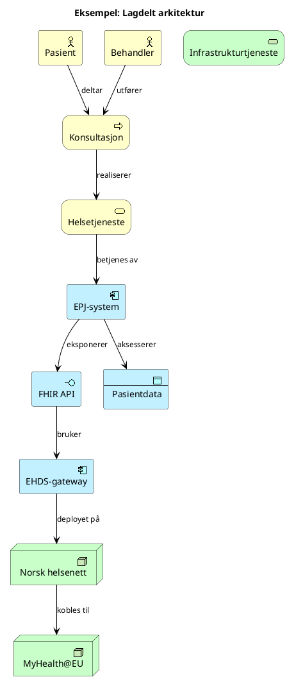
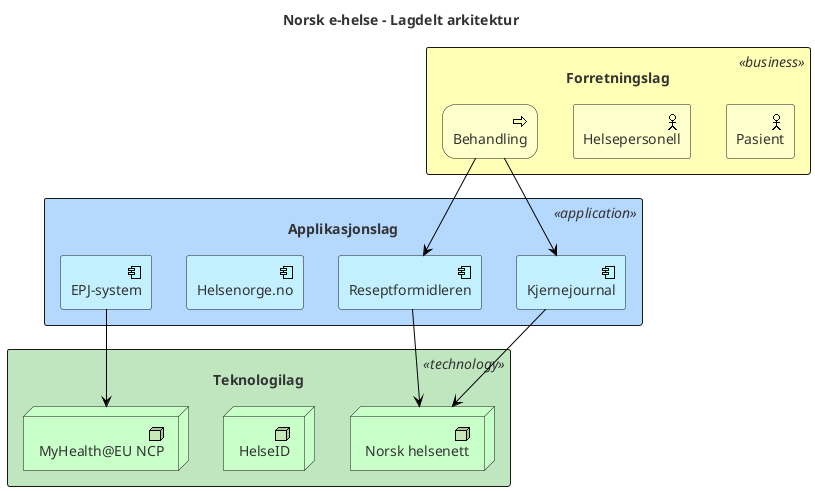
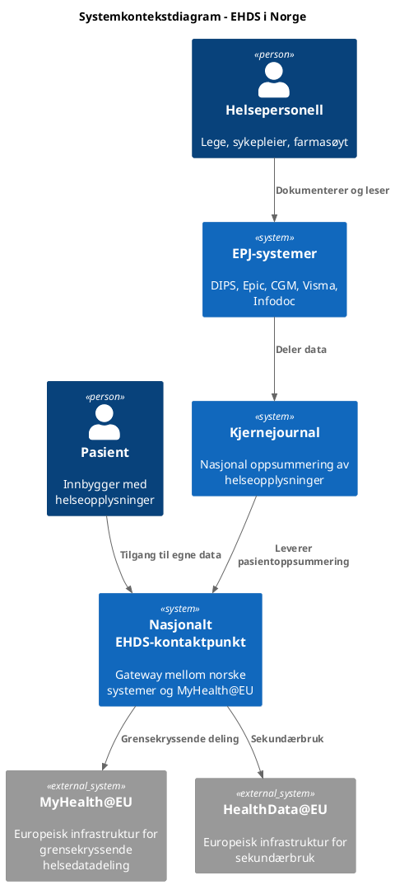

# ArchiMate-modellering med PlantUML og Draw.io

## Valg av format

| Format | Bruk når | Styrker |
|---|---|---|
| **PlantUML** (.puml) | Enkle til middels komplekse diagrammer, automatisert generering, versjonskontroll | Tekstbasert, reproduserbart, god ArchiMate-støtte, generer SVG/PNG |
| **Draw.io** (.drawio) | Komplekse interaktive diagrammer, manuell redigering, presentasjoner | Visuell editor, drag-and-drop, kan embeddes i HTML, rik formatering |

## Fargekonvensjoner per lag (gjelder begge formater)

| ArchiMate-lag | Farge | Hex | Bruk |
|---|---|---|---|
| Strategy | Lys rosa | `#F5DEB3` | Mål, kapabiliteter, ressurser |
| Business | Gul | `#FFFFB5` | Prosesser, aktører, tjenester |
| Application | Lyseblå | `#B5D8FF` | Komponenter, grensesnitt, data |
| Technology | Lysegrønn | `#C0E6C0` | Noder, infrastruktur, nettverk |
| Motivation | Lilla | `#D4B5FF` | Drivere, mål, krav, prinsipper |

---

## PlantUML

### Grunnleggende ArchiMate-diagram



### Lagdelt visning med rektangler



### C4-modell med PlantUML



### PlantUML elementtyper for ArchiMate

| ArchiMate-element | PlantUML-makro |
|---|---|
| Business Actor | `Business_Actor(id, "navn")` |
| Business Process | `Business_Process(id, "navn")` |
| Business Service | `Business_Service(id, "navn")` |
| Application Component | `Application_Component(id, "navn")` |
| Application Interface | `Application_Interface(id, "navn")` |
| Application Service | `Application_Service(id, "navn")` |
| Data Object | `Application_DataObject(id, "navn")` |
| Technology Node | `Technology_Node(id, "navn")` |
| Infrastructure Service | `Technology_Service(id, "navn")` |

### PlantUML relasjonstyper

| ArchiMate-relasjon | PlantUML-pil | Betydning |
|---|---|---|
| Composition | `*-->` | "er del av" |
| Aggregation | `o-->` | "grupperer" |
| Assignment | `-->` | "er tildelt" |
| Serving | `-->` med label | "betjener" |
| Flow | `..>` | "flyt av informasjon/verdi" |
| Triggering | `==>` | "utløser" |
| Access | `-->` med label "reads/writes" | "aksesserer data" |
| Realization | `..|>` | "realiserer" |

### Generering av PlantUML-bilder

PlantUML-filer (.puml) kan konverteres til bilder på flere måter:
- **PlantUML JAR**: `java -jar plantuml.jar diagram.puml` → genererer PNG
- **PlantUML server**: Online rendering via plantuml.com/plantuml
- **VS Code**: PlantUML-utvidelse for live forhåndsvisning
- **SVG-eksport**: `java -jar plantuml.jar -tsvg diagram.puml`

Lagre .puml-filer i `visualiseringer/` sammen med genererte bilder.

---

## Draw.io

### Når Draw.io brukes

Draw.io (.drawio XML-filer) brukes for:
- Komplekse diagrammer som krever manuell layout-justering
- Diagrammer som skal redigeres visuelt av andre
- Presentasjonsklare diagrammer med rik formatering
- Diagrammer som embeddes i HTML-visualiseringer

### Draw.io XML-struktur for ArchiMate

```xml
        <mxGraphModel dx="2190" dy="851" grid="1" gridSize="10" guides="1" tooltips="1" connect="1" arrows="1" fold="1" page="1" pageScale="1" pageWidth="1169" pageHeight="827" math="0" shadow="0">
            <root>
                <mxCell id="0"/>
                <mxCell id="1" parent="0"/>
                <mxCell id="45" value="&lt;div&gt;&lt;br&gt;&lt;/div&gt;&lt;div&gt;&lt;br&gt;&lt;/div&gt;&lt;div&gt;&lt;br&gt;&lt;/div&gt;&lt;div&gt;&lt;br&gt;&lt;/div&gt;&lt;div&gt;&lt;br&gt;&lt;/div&gt;&lt;div&gt;&lt;br&gt;&lt;/div&gt;&lt;div&gt;&lt;br&gt;&lt;/div&gt;&lt;div&gt;&lt;br&gt;&lt;/div&gt;&lt;div&gt;&lt;br&gt;&lt;/div&gt;&lt;div&gt;&lt;br&gt;&lt;/div&gt;&lt;div&gt;&lt;br&gt;&lt;/div&gt;&lt;div&gt;&lt;br&gt;&lt;/div&gt;&lt;div&gt;&lt;br&gt;&lt;/div&gt;&lt;div&gt;&lt;br&gt;&lt;/div&gt;&lt;div&gt;&lt;br&gt;&lt;/div&gt;&lt;div&gt;&lt;br&gt;&lt;/div&gt;&lt;div&gt;&lt;br&gt;&lt;/div&gt;&lt;div&gt;&lt;br&gt;&lt;/div&gt;&lt;div&gt;&lt;br&gt;&lt;/div&gt;&lt;div&gt;&lt;br&gt;&lt;/div&gt;&lt;div&gt;&lt;br&gt;&lt;/div&gt;&lt;div&gt;&lt;br&gt;&lt;/div&gt;" style="html=1;outlineConnect=0;whiteSpace=wrap;shape=mxgraph.archimate3.application;appType=grouping;archiType=square;dashed=1;fillColor=none;align=left;" parent="1" vertex="1">
                    <mxGeometry x="460" width="640" height="810" as="geometry"/>
                </mxCell>
                <mxCell id="44" value="&lt;div&gt;Forretningsarkitektur&lt;/div&gt;&lt;div&gt;&lt;br&gt;&lt;/div&gt;&lt;div&gt;&lt;br&gt;&lt;/div&gt;&lt;div&gt;&lt;br&gt;&lt;/div&gt;&lt;div&gt;&lt;br&gt;&lt;/div&gt;&lt;div&gt;&lt;br&gt;&lt;/div&gt;&lt;div&gt;&lt;br&gt;&lt;/div&gt;&lt;div&gt;&lt;br&gt;&lt;/div&gt;&lt;div&gt;&lt;br&gt;&lt;/div&gt;&lt;div&gt;&lt;br&gt;&lt;/div&gt;&lt;div&gt;&lt;br&gt;&lt;/div&gt;&lt;div&gt;&lt;br&gt;&lt;/div&gt;&lt;div&gt;&lt;br&gt;&lt;/div&gt;&lt;div&gt;&lt;br&gt;&lt;/div&gt;&lt;div&gt;&lt;br&gt;&lt;/div&gt;&lt;div&gt;&lt;br&gt;&lt;/div&gt;&lt;div&gt;&lt;br&gt;&lt;/div&gt;&lt;div&gt;&lt;br&gt;&lt;/div&gt;&lt;div&gt;&lt;br&gt;&lt;/div&gt;&lt;div&gt;&lt;br&gt;&lt;/div&gt;&lt;div&gt;&lt;br&gt;&lt;/div&gt;&lt;div&gt;&lt;br&gt;&lt;/div&gt;&lt;div&gt;&lt;br&gt;&lt;/div&gt;&lt;div&gt;&lt;br&gt;&lt;/div&gt;" style="html=1;outlineConnect=0;whiteSpace=wrap;shape=mxgraph.archimate3.application;appType=grouping;archiType=square;dashed=1;fillColor=none;align=left;" parent="1" vertex="1">
                    <mxGeometry x="470" y="20" width="620" height="380" as="geometry"/>
                </mxCell>
                <mxCell id="31" value="Strategi for realisering&lt;div&gt;&lt;div&gt;&lt;font color=&quot;#000000&quot;&gt;&lt;br&gt;&lt;/font&gt;&lt;/div&gt;&lt;div&gt;&lt;font color=&quot;#000000&quot;&gt;&lt;br&gt;&lt;/font&gt;&lt;/div&gt;&lt;div&gt;&lt;font color=&quot;#000000&quot;&gt;&lt;br&gt;&lt;/font&gt;&lt;/div&gt;&lt;div&gt;&lt;font color=&quot;#000000&quot;&gt;&lt;br&gt;&lt;/font&gt;&lt;/div&gt;&lt;div&gt;&lt;font color=&quot;#000000&quot;&gt;&lt;br&gt;&lt;/font&gt;&lt;/div&gt;&lt;div&gt;&lt;font color=&quot;#000000&quot;&gt;&lt;br&gt;&lt;/font&gt;&lt;/div&gt;&lt;div&gt;&lt;font color=&quot;#000000&quot;&gt;&lt;br&gt;&lt;/font&gt;&lt;/div&gt;&lt;div&gt;&lt;font color=&quot;#000000&quot;&gt;&lt;br&gt;&lt;/font&gt;&lt;div&gt;&lt;br&gt;&lt;/div&gt;&lt;div&gt;&lt;br&gt;&lt;/div&gt;&lt;div&gt;&lt;br&gt;&lt;/div&gt;&lt;/div&gt;&lt;/div&gt;" style="html=1;outlineConnect=0;whiteSpace=wrap;shape=mxgraph.archimate3.application;appType=grouping;archiType=square;dashed=1;fillColor=none;align=left;" parent="1" vertex="1">
                    <mxGeometry x="50" y="610" width="380" height="180" as="geometry"/>
                </mxCell>
                <mxCell id="30" value="Hva skal vi oppnå&lt;div&gt;&lt;font color=&quot;#000000&quot;&gt;&lt;br&gt;&lt;/font&gt;&lt;/div&gt;&lt;div&gt;&lt;font color=&quot;#000000&quot;&gt;&lt;br&gt;&lt;/font&gt;&lt;/div&gt;&lt;div&gt;&lt;font color=&quot;#000000&quot;&gt;&lt;br&gt;&lt;/font&gt;&lt;/div&gt;&lt;div&gt;&lt;font color=&quot;#000000&quot;&gt;&lt;br&gt;&lt;/font&gt;&lt;/div&gt;&lt;div&gt;&lt;font color=&quot;#000000&quot;&gt;&lt;br&gt;&lt;/font&gt;&lt;/div&gt;&lt;div&gt;&lt;font color=&quot;#000000&quot;&gt;&lt;br&gt;&lt;/font&gt;&lt;/div&gt;&lt;div&gt;&lt;font color=&quot;#000000&quot;&gt;&lt;br&gt;&lt;/font&gt;&lt;/div&gt;&lt;div&gt;&lt;font color=&quot;#000000&quot;&gt;&lt;br&gt;&lt;/font&gt;&lt;/div&gt;&lt;div&gt;&lt;font color=&quot;#000000&quot;&gt;&lt;br&gt;&lt;/font&gt;&lt;div&gt;&lt;br&gt;&lt;/div&gt;&lt;div&gt;&lt;br&gt;&lt;/div&gt;&lt;div&gt;&lt;br&gt;&lt;/div&gt;&lt;/div&gt;" style="html=1;outlineConnect=0;whiteSpace=wrap;shape=mxgraph.archimate3.application;appType=grouping;archiType=square;dashed=1;fillColor=none;align=left;" parent="1" vertex="1">
                    <mxGeometry x="50" y="260" width="380" height="200" as="geometry"/>
                </mxCell>
                <mxCell id="29" value="Hvorfor&lt;div&gt;&lt;br&gt;&lt;/div&gt;&lt;div&gt;&lt;br&gt;&lt;/div&gt;&lt;div&gt;&lt;br&gt;&lt;/div&gt;&lt;div&gt;&lt;br&gt;&lt;/div&gt;&lt;div&gt;&lt;br&gt;&lt;/div&gt;&lt;div&gt;&lt;br&gt;&lt;/div&gt;&lt;div&gt;&lt;br&gt;&lt;/div&gt;&lt;div&gt;&lt;br&gt;&lt;/div&gt;&lt;div&gt;&lt;br&gt;&lt;/div&gt;&lt;div&gt;&lt;br&gt;&lt;/div&gt;&lt;div&gt;&lt;br&gt;&lt;/div&gt;&lt;div&gt;&lt;br&gt;&lt;/div&gt;&lt;div&gt;&lt;br&gt;&lt;/div&gt;&lt;div&gt;&lt;br&gt;&lt;/div&gt;" style="html=1;outlineConnect=0;whiteSpace=wrap;shape=mxgraph.archimate3.application;appType=grouping;archiType=square;dashed=1;fillColor=none;align=left;" parent="1" vertex="1">
                    <mxGeometry x="50" y="20" width="380" height="230" as="geometry"/>
                </mxCell>
                <mxCell id="2" value="Driver/concern" style="html=1;outlineConnect=0;whiteSpace=wrap;fillColor=#CCCCFF;shape=mxgraph.archimate3.application;appType=driver;archiType=oct;" parent="1" vertex="1">
                    <mxGeometry x="80" y="70" width="150" height="60" as="geometry"/>
                </mxCell>
                <mxCell id="3" value="Interessent" style="html=1;outlineConnect=0;whiteSpace=wrap;fillColor=#CCCCFF;shape=mxgraph.archimate3.application;appType=role;archiType=oct;" parent="1" vertex="1">
                    <mxGeometry x="260" y="70" width="150" height="60" as="geometry"/>
                </mxCell>
                <mxCell id="4" value="Barriere/analyse" style="html=1;outlineConnect=0;whiteSpace=wrap;fillColor=#CCCCFF;shape=mxgraph.archimate3.application;appType=assess;archiType=oct;" parent="1" vertex="1">
                    <mxGeometry x="80" y="170" width="150" height="60" as="geometry"/>
                </mxCell>
                <mxCell id="6" value="Outcome/ resultatmål" style="html=1;outlineConnect=0;whiteSpace=wrap;fillColor=#CCCCFF;shape=mxgraph.archimate3.application;appType=outcome;archiType=oct;" parent="1" vertex="1">
                    <mxGeometry x="80" y="290" width="150" height="60" as="geometry"/>
                </mxCell>
                <mxCell id="7" value="" style="html=1;endArrow=none;elbow=vertical;exitX=0.5;exitY=1;exitDx=0;exitDy=0;exitPerimeter=0;entryX=0.5;entryY=0;entryDx=0;entryDy=0;entryPerimeter=0;" parent="1" source="2" target="4" edge="1">
                    <mxGeometry width="160" relative="1" as="geometry">
                        <mxPoint x="555" y="110" as="sourcePoint"/>
                        <mxPoint x="555" y="150" as="targetPoint"/>
                    </mxGeometry>
                </mxCell>
                <mxCell id="9" value="" style="html=1;endArrow=none;elbow=vertical;exitX=0;exitY=0.5;exitDx=0;exitDy=0;exitPerimeter=0;entryX=1;entryY=0.5;entryDx=0;entryDy=0;entryPerimeter=0;" parent="1" source="3" target="2" edge="1">
                    <mxGeometry width="160" relative="1" as="geometry">
                        <mxPoint x="165" y="220" as="sourcePoint"/>
                        <mxPoint x="165" y="260" as="targetPoint"/>
                    </mxGeometry>
                </mxCell>
                <mxCell id="10" value="Mål" style="html=1;outlineConnect=0;whiteSpace=wrap;fillColor=#CCCCFF;shape=mxgraph.archimate3.application;appType=goal;archiType=oct;" parent="1" vertex="1">
                    <mxGeometry x="80" y="380" width="150" height="60" as="geometry"/>
                </mxCell>
                <mxCell id="13" value="" style="html=1;endArrow=none;elbow=vertical;exitX=0.5;exitY=1;exitDx=0;exitDy=0;exitPerimeter=0;entryX=0.5;entryY=0;entryDx=0;entryDy=0;entryPerimeter=0;" parent="1" source="6" target="10" edge="1">
                    <mxGeometry width="160" relative="1" as="geometry">
                        <mxPoint x="165" y="290" as="sourcePoint"/>
                        <mxPoint x="165" y="250" as="targetPoint"/>
                    </mxGeometry>
                </mxCell>
                <mxCell id="14" value="Verdi" style="shape=ellipse;html=1;whiteSpace=wrap;fillColor=#CCCCFF;" parent="1" vertex="1">
                    <mxGeometry x="260" y="170" width="150" height="60" as="geometry"/>
                </mxCell>
                <mxCell id="15" value="Verdikjede" style="html=1;outlineConnect=0;whiteSpace=wrap;fillColor=#F5DEAA;shape=mxgraph.archimate3.application;appType=valueStream;archiType=rounded;" parent="1" vertex="1">
                    <mxGeometry x="260" y="640" width="150" height="50" as="geometry"/>
                </mxCell>
                <mxCell id="16" value="Kapabilitet" style="html=1;outlineConnect=0;whiteSpace=wrap;fillColor=#F5DEAA;shape=mxgraph.archimate3.application;appType=capability;archiType=rounded;" parent="1" vertex="1">
                    <mxGeometry x="80" y="720" width="150" height="52.5" as="geometry"/>
                </mxCell>
                <mxCell id="17" value="Tiltak" style="html=1;outlineConnect=0;whiteSpace=wrap;fillColor=#F5DEAA;shape=mxgraph.archimate3.application;appType=course;archiType=rounded;" parent="1" vertex="1">
                    <mxGeometry x="80" y="640" width="150" height="50" as="geometry"/>
                </mxCell>
                <mxCell id="18" value="Ressurs" style="html=1;outlineConnect=0;whiteSpace=wrap;fillColor=#F5DEAA;shape=mxgraph.archimate3.application;appType=resource;archiType=square;" parent="1" vertex="1">
                    <mxGeometry x="260" y="720" width="150" height="50" as="geometry"/>
                </mxCell>
                <mxCell id="20" value="Rolle" style="html=1;outlineConnect=0;whiteSpace=wrap;fillColor=#ffff99;shape=mxgraph.archimate3.role;" parent="1" vertex="1">
                    <mxGeometry x="710" y="75" width="150" height="60" as="geometry"/>
                </mxCell>
                <mxCell id="21" value="Forretningsprosess" style="html=1;outlineConnect=0;whiteSpace=wrap;fillColor=#ffff99;shape=mxgraph.archimate3.application;appType=proc;archiType=rounded;" parent="1" vertex="1">
                    <mxGeometry x="710" y="195" width="150" height="60" as="geometry"/>
                </mxCell>
                <mxCell id="22" value="Samhandlingstjeneste" style="html=1;outlineConnect=0;whiteSpace=wrap;fillColor=#ffff99;shape=mxgraph.archimate3.service;" parent="1" vertex="1">
                    <mxGeometry x="510" y="195" width="150" height="60" as="geometry"/>
                </mxCell>
                <mxCell id="23" value="Aktør" style="html=1;outlineConnect=0;whiteSpace=wrap;fillColor=#ffff99;shape=mxgraph.archimate3.application;appType=actor;archiType=square;" parent="1" vertex="1">
                    <mxGeometry x="910" y="75" width="150" height="60" as="geometry"/>
                </mxCell>
                <mxCell id="32" value="" style="html=1;endArrow=none;elbow=vertical;entryX=0.5;entryY=1;entryDx=0;entryDy=0;exitX=1;exitY=0.5;exitDx=0;exitDy=0;exitPerimeter=0;edgeStyle=orthogonalEdgeStyle;" parent="1" source="6" target="14" edge="1">
                    <mxGeometry width="160" relative="1" as="geometry">
                        <mxPoint x="650" y="390" as="sourcePoint"/>
                        <mxPoint x="580" y="370" as="targetPoint"/>
                    </mxGeometry>
                </mxCell>
                <mxCell id="33" value="" style="html=1;endArrow=none;elbow=vertical;entryX=0.5;entryY=1;entryDx=0;entryDy=0;exitX=0.5;exitY=0;exitDx=0;exitDy=0;entryPerimeter=0;edgeStyle=orthogonalEdgeStyle;" parent="1" source="14" target="3" edge="1">
                    <mxGeometry width="160" relative="1" as="geometry">
                        <mxPoint x="240" y="490" as="sourcePoint"/>
                        <mxPoint x="385" y="320" as="targetPoint"/>
                    </mxGeometry>
                </mxCell>
                <mxCell id="34" value="" style="html=1;endArrow=none;elbow=vertical;entryX=0.5;entryY=1;entryDx=0;entryDy=0;exitX=0.5;exitY=0;exitDx=0;exitDy=0;exitPerimeter=0;edgeStyle=orthogonalEdgeStyle;" parent="1" source="15" target="14" edge="1">
                    <mxGeometry width="160" relative="1" as="geometry">
                        <mxPoint x="240" y="390" as="sourcePoint"/>
                        <mxPoint x="385" y="320" as="targetPoint"/>
                    </mxGeometry>
                </mxCell>
                <mxCell id="35" value="Helsetjeneste" style="html=1;outlineConnect=0;whiteSpace=wrap;fillColor=#ffff99;shape=mxgraph.archimate3.service;" parent="1" vertex="1">
                    <mxGeometry x="510" y="75" width="150" height="60" as="geometry"/>
                </mxCell>
                <mxCell id="36" value="Informasjon" style="html=1;outlineConnect=0;whiteSpace=wrap;fillColor=#ffff99;shape=mxgraph.archimate3.businessObject;overflow=fill;" parent="1" vertex="1">
                    <mxGeometry x="510" y="310" width="150" height="60" as="geometry"/>
                </mxCell>
                <mxCell id="37" value="" style="edgeStyle=elbowEdgeStyle;html=1;endArrow=open;elbow=vertical;endFill=1;entryX=0;entryY=0.5;entryDx=0;entryDy=0;entryPerimeter=0;exitX=0;exitY=0;exitDx=150;exitDy=30;exitPerimeter=0;" parent="1" source="22" target="21" edge="1">
                    <mxGeometry width="160" relative="1" as="geometry">
                        <mxPoint x="650" y="455" as="sourcePoint"/>
                        <mxPoint x="810" y="455" as="targetPoint"/>
                    </mxGeometry>
                </mxCell>
                <mxCell id="38" value="" style="edgeStyle=elbowEdgeStyle;html=1;endArrow=open;elbow=vertical;endFill=0;dashed=1;startArrow=open;startFill=0;dashPattern=1 4;exitX=0.5;exitY=0;exitDx=0;exitDy=0;exitPerimeter=0;entryX=0.5;entryY=1;entryDx=0;entryDy=0;entryPerimeter=0;" parent="1" source="36" target="22" edge="1">
                    <mxGeometry width="160" relative="1" as="geometry">
                        <mxPoint x="650" y="455" as="sourcePoint"/>
                        <mxPoint x="810" y="455" as="targetPoint"/>
                    </mxGeometry>
                </mxCell>
                <mxCell id="39" value="" style="html=1;endArrow=block;elbow=vertical;endFill=0;dashed=1;entryX=0;entryY=0;entryDx=141.3;entryDy=51.3;entryPerimeter=0;exitX=0;exitY=0;exitDx=2.9;exitDy=2.9;exitPerimeter=0;" parent="1" source="21" target="35" edge="1">
                    <mxGeometry width="160" relative="1" as="geometry">
                        <mxPoint x="650" y="455" as="sourcePoint"/>
                        <mxPoint x="810" y="455" as="targetPoint"/>
                    </mxGeometry>
                </mxCell>
                <mxCell id="40" value="" style="edgeStyle=elbowEdgeStyle;html=1;endArrow=open;elbow=vertical;endFill=1;entryX=0.5;entryY=1;entryDx=0;entryDy=0;entryPerimeter=0;exitX=0.5;exitY=0;exitDx=0;exitDy=0;exitPerimeter=0;" parent="1" source="22" target="35" edge="1">
                    <mxGeometry width="160" relative="1" as="geometry">
                        <mxPoint x="650" y="455" as="sourcePoint"/>
                        <mxPoint x="810" y="455" as="targetPoint"/>
                    </mxGeometry>
                </mxCell>
                <mxCell id="41" value="" style="endArrow=block;html=1;endFill=1;startArrow=oval;startFill=1;edgeStyle=elbowEdgeStyle;elbow=vertical;entryX=0;entryY=0;entryDx=150;entryDy=30;entryPerimeter=0;exitX=0;exitY=0.5;exitDx=0;exitDy=0;exitPerimeter=0;" parent="1" source="20" target="35" edge="1">
                    <mxGeometry width="160" relative="1" as="geometry">
                        <mxPoint x="650" y="455" as="sourcePoint"/>
                        <mxPoint x="810" y="455" as="targetPoint"/>
                    </mxGeometry>
                </mxCell>
                <mxCell id="42" value="" style="endArrow=block;html=1;endFill=1;startArrow=oval;startFill=1;edgeStyle=elbowEdgeStyle;elbow=vertical;entryX=1;entryY=0.5;entryDx=0;entryDy=0;entryPerimeter=0;exitX=0;exitY=0.5;exitDx=0;exitDy=0;exitPerimeter=0;" parent="1" source="23" target="20" edge="1">
                    <mxGeometry width="160" relative="1" as="geometry">
                        <mxPoint x="650" y="455" as="sourcePoint"/>
                        <mxPoint x="810" y="455" as="targetPoint"/>
                    </mxGeometry>
                </mxCell>
                <mxCell id="43" value="" style="endArrow=block;html=1;endFill=1;startArrow=oval;startFill=1;edgeStyle=elbowEdgeStyle;elbow=vertical;exitX=0.5;exitY=1;exitDx=0;exitDy=0;exitPerimeter=0;entryX=0.5;entryY=0;entryDx=0;entryDy=0;entryPerimeter=0;" parent="1" source="20" target="21" edge="1">
                    <mxGeometry width="160" relative="1" as="geometry">
                        <mxPoint x="650" y="455" as="sourcePoint"/>
                        <mxPoint x="810" y="455" as="targetPoint"/>
                    </mxGeometry>
                </mxCell>
                <mxCell id="46" value="&lt;div&gt;Applikasjonsarkitektur&lt;/div&gt;&lt;div&gt;&lt;br&gt;&lt;/div&gt;&lt;div&gt;&lt;br&gt;&lt;/div&gt;&lt;div&gt;&lt;br&gt;&lt;/div&gt;&lt;div&gt;&lt;br&gt;&lt;/div&gt;&lt;div&gt;&lt;br&gt;&lt;/div&gt;&lt;div&gt;&lt;br&gt;&lt;/div&gt;&lt;div&gt;&lt;br&gt;&lt;/div&gt;" style="html=1;outlineConnect=0;whiteSpace=wrap;shape=mxgraph.archimate3.application;appType=grouping;archiType=square;dashed=1;fillColor=none;align=left;" parent="1" vertex="1">
                    <mxGeometry x="470" y="450" width="620" height="130" as="geometry"/>
                </mxCell>
                <mxCell id="52" value="" style="edgeStyle=orthogonalEdgeStyle;html=1;endArrow=none;elbow=vertical;entryX=1;entryY=0.75;entryDx=0;entryDy=0;entryPerimeter=0;exitX=1;exitY=0.25;exitDx=0;exitDy=0;exitPerimeter=0;curved=1;" parent="1" source="21" target="21" edge="1">
                    <mxGeometry width="160" relative="1" as="geometry">
                        <mxPoint x="870" y="220" as="sourcePoint"/>
                        <mxPoint x="870" y="250" as="targetPoint"/>
                        <Array as="points">
                            <mxPoint x="920" y="225"/>
                        </Array>
                    </mxGeometry>
                </mxCell>
                <mxCell id="55" value="" style="html=1;endArrow=block;elbow=vertical;endFill=0;dashed=1;entryX=1;entryY=0.5;entryDx=0;entryDy=0;entryPerimeter=0;" parent="1" source="45" target="60" edge="1">
                    <mxGeometry width="160" relative="1" as="geometry">
                        <mxPoint x="650" y="430" as="sourcePoint"/>
                        <mxPoint x="450" y="405" as="targetPoint"/>
                    </mxGeometry>
                </mxCell>
                <mxCell id="56" value="Applikasjons grensesnitt" style="html=1;outlineConnect=0;whiteSpace=wrap;fillColor=#99ffff;shape=mxgraph.archimate3.application;appType=interface;archiType=square;" parent="1" vertex="1">
                    <mxGeometry x="910" y="490" width="150" height="60" as="geometry"/>
                </mxCell>
                <mxCell id="57" value="Applikasjonstjeneste" style="html=1;outlineConnect=0;whiteSpace=wrap;fillColor=#99ffff;shape=mxgraph.archimate3.service;" parent="1" vertex="1">
                    <mxGeometry x="710" y="490" width="150" height="60" as="geometry"/>
                </mxCell>
                <mxCell id="59" value="" style="edgeStyle=elbowEdgeStyle;html=1;endArrow=block;elbow=vertical;endFill=0;dashed=1;entryX=0.5;entryY=1;entryDx=0;entryDy=0;entryPerimeter=0;exitX=0.5;exitY=0;exitDx=0;exitDy=0;exitPerimeter=0;" parent="1" source="46" target="44" edge="1">
                    <mxGeometry width="160" relative="1" as="geometry">
                        <mxPoint x="490" y="440" as="sourcePoint"/>
                        <mxPoint x="1280" y="440" as="targetPoint"/>
                    </mxGeometry>
                </mxCell>
                <mxCell id="u-3Nm1wCuTtx4gbuLaas-59" value="" style="edgeStyle=elbowEdgeStyle;html=1;endArrow=block;elbow=vertical;endFill=0;dashed=1;entryX=0.5;entryY=1;entryDx=0;entryDy=0;entryPerimeter=0;exitX=0.5;exitY=0;exitDx=0;exitDy=0;exitPerimeter=0;" parent="1" source="17" target="10" edge="1">
                    <mxGeometry width="160" relative="1" as="geometry">
                        <mxPoint x="520" y="440" as="sourcePoint"/>
                        <mxPoint x="680" y="440" as="targetPoint"/>
                    </mxGeometry>
                </mxCell>
                <mxCell id="u-3Nm1wCuTtx4gbuLaas-60" value="" style="edgeStyle=elbowEdgeStyle;html=1;endArrow=block;elbow=vertical;endFill=0;dashed=1;entryX=0.5;entryY=1;entryDx=0;entryDy=0;entryPerimeter=0;exitX=0.5;exitY=0;exitDx=0;exitDy=0;exitPerimeter=0;" parent="1" source="16" target="17" edge="1">
                    <mxGeometry width="160" relative="1" as="geometry">
                        <mxPoint x="165" y="650" as="sourcePoint"/>
                        <mxPoint x="165" y="590" as="targetPoint"/>
                    </mxGeometry>
                </mxCell>
                <mxCell id="u-3Nm1wCuTtx4gbuLaas-61" value="" style="html=1;endArrow=block;elbow=vertical;endFill=0;dashed=1;entryX=1;entryY=0.5;entryDx=0;entryDy=0;entryPerimeter=0;exitX=0;exitY=0.5;exitDx=0;exitDy=0;exitPerimeter=0;" parent="1" source="15" target="17" edge="1">
                    <mxGeometry width="160" relative="1" as="geometry">
                        <mxPoint x="175" y="660" as="sourcePoint"/>
                        <mxPoint x="175" y="600" as="targetPoint"/>
                    </mxGeometry>
                </mxCell>
                <mxCell id="u-3Nm1wCuTtx4gbuLaas-62" value="" style="html=1;endArrow=open;elbow=vertical;endFill=1;entryX=0;entryY=1;entryDx=2.9;entryDy=-2.9;entryPerimeter=0;exitX=1;exitY=0;exitDx=-2.9;exitDy=2.9;exitPerimeter=0;" parent="1" source="16" target="15" edge="1">
                    <mxGeometry width="160" relative="1" as="geometry">
                        <mxPoint x="240" y="746" as="sourcePoint"/>
                        <mxPoint x="680" y="510" as="targetPoint"/>
                    </mxGeometry>
                </mxCell>
                <mxCell id="u-3Nm1wCuTtx4gbuLaas-65" value="" style="endArrow=block;html=1;endFill=1;startArrow=oval;startFill=1;edgeStyle=elbowEdgeStyle;elbow=vertical;entryX=1;entryY=0.5;entryDx=0;entryDy=0;entryPerimeter=0;exitX=0;exitY=0.5;exitDx=0;exitDy=0;exitPerimeter=0;" parent="1" source="18" target="16" edge="1">
                    <mxGeometry width="160" relative="1" as="geometry">
                        <mxPoint x="520" y="510" as="sourcePoint"/>
                        <mxPoint x="680" y="510" as="targetPoint"/>
                    </mxGeometry>
                </mxCell>
                <mxCell id="u-3Nm1wCuTtx4gbuLaas-66" value="" style="endArrow=block;html=1;endFill=1;startArrow=oval;startFill=1;edgeStyle=elbowEdgeStyle;elbow=vertical;entryX=0;entryY=0;entryDx=150;entryDy=30;entryPerimeter=0;exitX=0;exitY=0.5;exitDx=0;exitDy=0;exitPerimeter=0;" parent="1" source="56" target="57" edge="1">
                    <mxGeometry width="160" relative="1" as="geometry">
                        <mxPoint x="690" y="440" as="sourcePoint"/>
                        <mxPoint x="850" y="440" as="targetPoint"/>
                    </mxGeometry>
                </mxCell>
                <mxCell id="u-3Nm1wCuTtx4gbuLaas-67" value="Data objekt" style="html=1;outlineConnect=0;whiteSpace=wrap;fillColor=#99ffff;shape=mxgraph.archimate3.businessObject;overflow=fill;" parent="1" vertex="1">
                    <mxGeometry x="510" y="490" width="150" height="60" as="geometry"/>
                </mxCell>
                <mxCell id="u-3Nm1wCuTtx4gbuLaas-68" value="" style="edgeStyle=elbowEdgeStyle;html=1;endArrow=open;elbow=vertical;endFill=0;dashed=1;dashPattern=1 4;entryX=1;entryY=0.5;entryDx=0;entryDy=0;entryPerimeter=0;exitX=0;exitY=0;exitDx=0;exitDy=30;exitPerimeter=0;" parent="1" source="57" target="u-3Nm1wCuTtx4gbuLaas-67" edge="1">
                    <mxGeometry width="160" relative="1" as="geometry">
                        <mxPoint x="490" y="440" as="sourcePoint"/>
                        <mxPoint x="650" y="440" as="targetPoint"/>
                    </mxGeometry>
                </mxCell>
                <mxCell id="u-3Nm1wCuTtx4gbuLaas-69" value="" style="edgeStyle=elbowEdgeStyle;html=1;endArrow=open;elbow=vertical;endFill=1;entryX=0.5;entryY=1;entryDx=0;entryDy=0;entryPerimeter=0;exitX=0.5;exitY=0;exitDx=0;exitDy=0;exitPerimeter=0;" parent="1" source="57" target="21" edge="1">
                    <mxGeometry width="160" relative="1" as="geometry">
                        <mxPoint x="490" y="440" as="sourcePoint"/>
                        <mxPoint x="650" y="440" as="targetPoint"/>
                    </mxGeometry>
                </mxCell>
                <mxCell id="u-3Nm1wCuTtx4gbuLaas-70" value="" style="edgeStyle=elbowEdgeStyle;html=1;endArrow=open;elbow=vertical;endFill=1;entryX=0.5;entryY=1;entryDx=0;entryDy=0;entryPerimeter=0;exitX=0.5;exitY=0;exitDx=0;exitDy=0;exitPerimeter=0;" parent="1" source="56" target="23" edge="1">
                    <mxGeometry width="160" relative="1" as="geometry">
                        <mxPoint x="795" y="500" as="sourcePoint"/>
                        <mxPoint x="795" y="265" as="targetPoint"/>
                    </mxGeometry>
                </mxCell>
                <mxCell id="-KB6YOGtwfdlGz7-wui1-59" value="Rammer&lt;div&gt;&lt;font color=&quot;#000000&quot;&gt;&lt;br&gt;&lt;/font&gt;&lt;/div&gt;&lt;div&gt;&lt;font color=&quot;#000000&quot;&gt;&lt;br&gt;&lt;/font&gt;&lt;/div&gt;&lt;div&gt;&lt;font color=&quot;#000000&quot;&gt;&lt;br&gt;&lt;/font&gt;&lt;/div&gt;&lt;div&gt;&lt;font color=&quot;#000000&quot;&gt;&lt;br&gt;&lt;/font&gt;&lt;div&gt;&lt;br&gt;&lt;/div&gt;&lt;div&gt;&lt;br&gt;&lt;/div&gt;&lt;div&gt;&lt;br&gt;&lt;/div&gt;&lt;/div&gt;" style="html=1;outlineConnect=0;whiteSpace=wrap;shape=mxgraph.archimate3.application;appType=grouping;archiType=square;dashed=1;fillColor=none;align=left;" parent="1" vertex="1">
                    <mxGeometry x="50" y="470" width="380" height="130" as="geometry"/>
                </mxCell>
                <mxCell id="-KB6YOGtwfdlGz7-wui1-60" value="Prinsipp" style="html=1;outlineConnect=0;whiteSpace=wrap;fillColor=#CCCCFF;shape=mxgraph.archimate3.application;appType=principle;archiType=oct;" parent="1" vertex="1">
                    <mxGeometry x="310" y="502.5" width="100" height="65" as="geometry"/>
                </mxCell>
                <mxCell id="-KB6YOGtwfdlGz7-wui1-64" value="Krav" style="html=1;outlineConnect=0;whiteSpace=wrap;fillColor=#CCCCFF;shape=mxgraph.archimate3.requirement;" parent="1" vertex="1">
                    <mxGeometry x="190" y="502.5" width="100" height="67.5" as="geometry"/>
                </mxCell>
                <mxCell id="-KB6YOGtwfdlGz7-wui1-65" value="Beskrankning" style="html=1;outlineConnect=0;whiteSpace=wrap;fillColor=#CCCCFF;shape=mxgraph.archimate3.constraint;" parent="1" vertex="1">
                    <mxGeometry x="70" y="502.5" width="100" height="70" as="geometry"/>
                </mxCell>
                <mxCell id="-KB6YOGtwfdlGz7-wui1-68" value="" style="html=1;endArrow=none;elbow=vertical;exitX=0.5;exitY=1;exitDx=0;exitDy=0;exitPerimeter=0;entryX=0.5;entryY=0;entryDx=0;entryDy=0;entryPerimeter=0;" parent="1" source="4" target="6" edge="1">
                    <mxGeometry width="160" relative="1" as="geometry">
                        <mxPoint x="165" y="360" as="sourcePoint"/>
                        <mxPoint x="165" y="390" as="targetPoint"/>
                    </mxGeometry>
                </mxCell>
                <mxCell id="-KB6YOGtwfdlGz7-wui1-69" value="" style="html=1;endArrow=none;elbow=vertical;exitX=0.5;exitY=1;exitDx=0;exitDy=0;exitPerimeter=0;entryX=0.5;entryY=0;entryDx=0;entryDy=0;entryPerimeter=0;" parent="1" source="30" target="-KB6YOGtwfdlGz7-wui1-59" edge="1">
                    <mxGeometry width="160" relative="1" as="geometry">
                        <mxPoint x="175" y="370" as="sourcePoint"/>
                        <mxPoint x="175" y="400" as="targetPoint"/>
                    </mxGeometry>
                </mxCell>
                <mxCell id="60" value="Motivasjon&lt;div&gt;&lt;br&gt;&lt;/div&gt;&lt;div&gt;&lt;br&gt;&lt;/div&gt;&lt;div&gt;&lt;br&gt;&lt;/div&gt;&lt;div&gt;&lt;br&gt;&lt;/div&gt;&lt;div&gt;&lt;br&gt;&lt;/div&gt;&lt;div&gt;&lt;br&gt;&lt;/div&gt;&lt;div&gt;&lt;br&gt;&lt;/div&gt;&lt;div&gt;&lt;br&gt;&lt;/div&gt;&lt;div&gt;&lt;br&gt;&lt;/div&gt;&lt;div&gt;&lt;br&gt;&lt;/div&gt;&lt;div&gt;&lt;br&gt;&lt;/div&gt;&lt;div&gt;&lt;br&gt;&lt;/div&gt;&lt;div&gt;&lt;br&gt;&lt;/div&gt;&lt;div&gt;&lt;br&gt;&lt;/div&gt;&lt;div&gt;&lt;br&gt;&lt;/div&gt;&lt;div&gt;&lt;br&gt;&lt;/div&gt;&lt;div&gt;&lt;br&gt;&lt;/div&gt;&lt;div&gt;&lt;br&gt;&lt;/div&gt;&lt;div&gt;&lt;br&gt;&lt;/div&gt;&lt;div&gt;&lt;br&gt;&lt;/div&gt;&lt;div&gt;&lt;br&gt;&lt;/div&gt;&lt;div&gt;&lt;br&gt;&lt;/div&gt;&lt;div&gt;&lt;br&gt;&lt;/div&gt;&lt;div&gt;&lt;br&gt;&lt;/div&gt;&lt;div&gt;&lt;br&gt;&lt;/div&gt;&lt;div&gt;&lt;br&gt;&lt;/div&gt;&lt;div&gt;&lt;br&gt;&lt;/div&gt;&lt;div&gt;&lt;br&gt;&lt;/div&gt;&lt;div&gt;&lt;br&gt;&lt;/div&gt;&lt;div&gt;&lt;br&gt;&lt;/div&gt;&lt;div&gt;&lt;br&gt;&lt;/div&gt;&lt;div&gt;&lt;br&gt;&lt;/div&gt;&lt;div&gt;&lt;br&gt;&lt;/div&gt;&lt;div&gt;&lt;br&gt;&lt;/div&gt;&lt;div&gt;&lt;br&gt;&lt;/div&gt;&lt;div&gt;&lt;br&gt;&lt;/div&gt;&lt;div&gt;&lt;br&gt;&lt;/div&gt;&lt;div&gt;&lt;br&gt;&lt;/div&gt;&lt;div&gt;&lt;br&gt;&lt;/div&gt;&lt;div&gt;&lt;br&gt;&lt;/div&gt;&lt;div&gt;&lt;br&gt;&lt;/div&gt;&lt;div&gt;&lt;br&gt;&lt;/div&gt;&lt;div&gt;&lt;br&gt;&lt;/div&gt;&lt;div&gt;&lt;br&gt;&lt;/div&gt;&lt;div&gt;&lt;br&gt;&lt;/div&gt;&lt;div&gt;&lt;br&gt;&lt;/div&gt;&lt;div&gt;&lt;br&gt;&lt;/div&gt;&lt;div&gt;&lt;br&gt;&lt;/div&gt;&lt;div&gt;&lt;br&gt;&lt;/div&gt;&lt;div&gt;&lt;br&gt;&lt;/div&gt;&lt;div&gt;&lt;br&gt;&lt;/div&gt;&lt;div&gt;&lt;br&gt;&lt;/div&gt;&lt;div&gt;&lt;br&gt;&lt;/div&gt;&lt;div&gt;&lt;br&gt;&lt;/div&gt;&lt;div&gt;&lt;br&gt;&lt;/div&gt;" style="html=1;outlineConnect=0;whiteSpace=wrap;shape=mxgraph.archimate3.application;appType=grouping;archiType=square;dashed=1;fillColor=none;align=left;" parent="1" vertex="1">
                    <mxGeometry x="40" width="400" height="810" as="geometry"/>
                </mxCell>
            </root>
        </mxGraphModel>
```

### Draw.io stilkonvensjoner

| Element | style-attributter |
|---|---|
| Forretningslag | `fillColor=#FFFFB5;strokeColor=#d6b656;fontColor=#333333` |
| Applikasjonslag | `fillColor=#B5D8FF;strokeColor=#6c8ebf;fontColor=#333333` |
| Teknologilag | `fillColor=#C0E6C0;strokeColor=#82b366;fontColor=#333333` |
| Motivasjonslag | `fillColor=#D4B5FF;strokeColor=#9673a6;fontColor=#333333` |
| Strategilag | `fillColor=#F5DEB3;strokeColor=#d6b656;fontColor=#333333` |
| Relasjoner | `strokeColor=#666666;fontColor=#333333` |

**VIKTIG:** Bruk alltid `fontColor=#333333` for god lesbarhet.

### Draw.io ArchiMate-shapes

Draw.io har innebygd ArchiMate 3.0-bibliotek. Bruk shape-prefiks `mxgraph.archimate3.*`:
- `mxgraph.archimate3.actor` – Business Actor
- `mxgraph.archimate3.process` – Business Process
- `mxgraph.archimate3.service` – Service (alle lag)
- `mxgraph.archimate3.application` – Application Component
- `mxgraph.archimate3.tech` – Technology Node

### Lagring og bruk

- Lagre .drawio-filer i `visualiseringer/`
- Kan åpnes i draw.io (app.diagrams.net) for redigering
- Eksporter til SVG/PNG for bruk i HTML-rapporter
- Draw.io-filer kan embeddes direkte i HTML med JavaScript-biblioteket

---

## Diagrammatisk resonnering

Bruk diagrammer aktivt som analyseverktøy, ikke bare dokumentasjon:
1. **Start med aktører og tjenester** – hvem gjør hva?
2. **Legg til applikasjoner** – hvilke systemer støtter prosessene?
3. **Vis dataflyt** – hvor går informasjonen?
4. **Identifiser gap** – mangler det forbindelser eller komponenter?
5. **Velg riktig format** – PlantUML for raske skisser og versjonskontroll, Draw.io for presentasjonsklare diagrammer

## Vanlige feil

- Blander farger vilkårlig uten å følge lagkonvensjoner
- Lager for komplekse diagrammer – del opp i flere visninger
- Glemmer å vise relasjoner mellom lag
- Bruker lys tekst på lyse bakgrunner – bruk alltid mørk tekst (#333333)
- Bruker PlantUML når Draw.io hadde vært bedre egnet (og omvendt)
