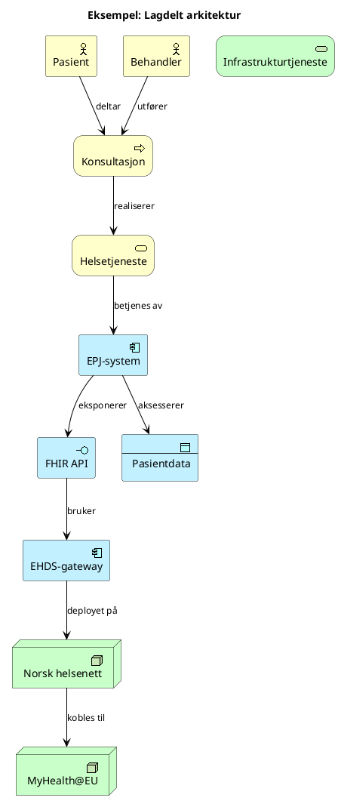
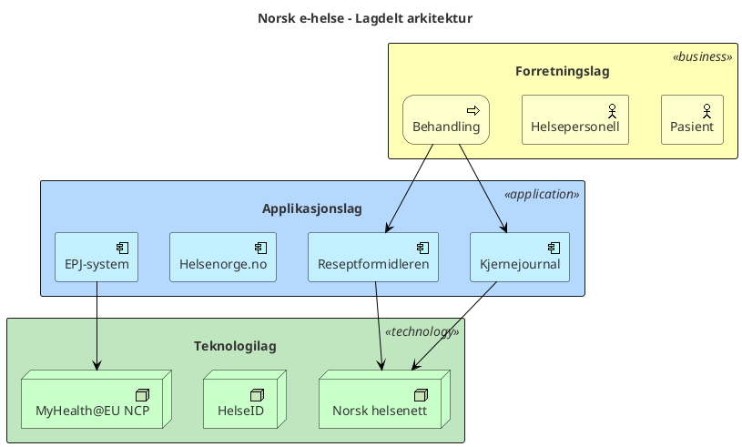
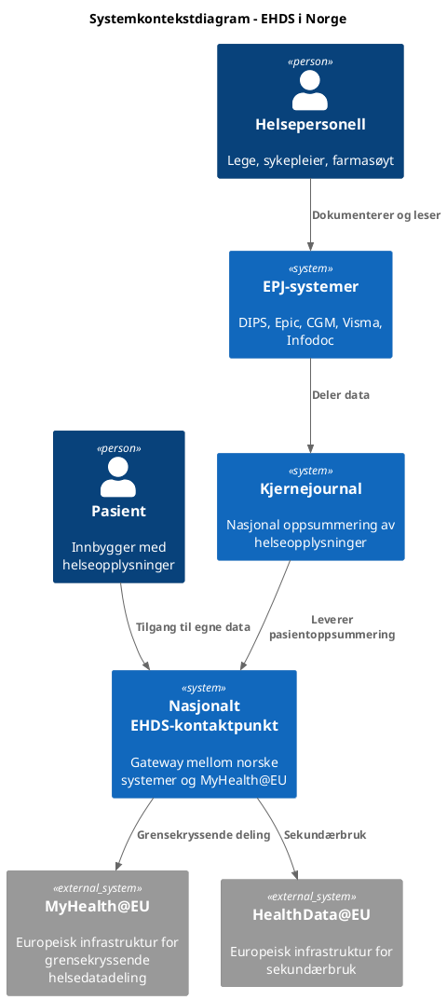

# ArchiMate-modellering med PlantUML og Draw.io

## Valg av format

| Format | Bruk når | Styrker |
|---|---|---|
| **PlantUML** (.puml) | Enkle til middels komplekse diagrammer, automatisert generering, versjonskontroll | Tekstbasert, reproduserbart, god ArchiMate-støtte, generer SVG/PNG |
| **Draw.io** (.drawio) | Komplekse interaktive diagrammer, manuell redigering, presentasjoner | Visuell editor, drag-and-drop, kan embeddes i HTML, rik formatering |

## Fargekonvensjoner per lag (gjelder begge formater)

| ArchiMate-lag | Farge | Hex | Bruk |
|---|---|---|---|
| Strategy | Lys rosa | `#F5DEB3` | Mål, kapabiliteter, ressurser |
| Business | Gul | `#FFFFB5` | Prosesser, aktører, tjenester |
| Application | Lyseblå | `#B5D8FF` | Komponenter, grensesnitt, data |
| Technology | Lysegrønn | `#C0E6C0` | Noder, infrastruktur, nettverk |
| Motivation | Lilla | `#D4B5FF` | Drivere, mål, krav, prinsipper |

---

## PlantUML

### Grunnleggende ArchiMate-diagram



### Lagdelt visning med rektangler



### C4-modell med PlantUML



### PlantUML elementtyper for ArchiMate

| ArchiMate-element | PlantUML-makro |
|---|---|
| Business Actor | `Business_Actor(id, "navn")` |
| Business Process | `Business_Process(id, "navn")` |
| Business Service | `Business_Service(id, "navn")` |
| Application Component | `Application_Component(id, "navn")` |
| Application Interface | `Application_Interface(id, "navn")` |
| Application Service | `Application_Service(id, "navn")` |
| Data Object | `Application_DataObject(id, "navn")` |
| Technology Node | `Technology_Node(id, "navn")` |
| Infrastructure Service | `Technology_Service(id, "navn")` |

### PlantUML relasjonstyper

| ArchiMate-relasjon | PlantUML-pil | Betydning |
|---|---|---|
| Composition | `*-->` | "er del av" |
| Aggregation | `o-->` | "grupperer" |
| Assignment | `-->` | "er tildelt" |
| Serving | `-->` med label | "betjener" |
| Flow | `..>` | "flyt av informasjon/verdi" |
| Triggering | `==>` | "utløser" |
| Access | `-->` med label "reads/writes" | "aksesserer data" |
| Realization | `..|>` | "realiserer" |

### Generering av PlantUML-bilder

PlantUML-filer (.puml) kan konverteres til bilder på flere måter:
- **PlantUML JAR**: `java -jar plantuml.jar diagram.puml` → genererer PNG
- **PlantUML server**: Online rendering via plantuml.com/plantuml
- **VS Code**: PlantUML-utvidelse for live forhåndsvisning
- **SVG-eksport**: `java -jar plantuml.jar -tsvg diagram.puml`

Lagre .puml-filer i `visualiseringer/` sammen med genererte bilder.

---

## Draw.io

### Når Draw.io brukes

Draw.io (.drawio XML-filer) brukes for:
- Komplekse diagrammer som krever manuell layout-justering
- Diagrammer som skal redigeres visuelt av andre
- Presentasjonsklare diagrammer med rik formatering
- Diagrammer som embeddes i HTML-visualiseringer

### Draw.io XML-struktur for ArchiMate

```xml
<mxfile>
  <diagram name="Lagdelt arkitektur">
    <mxGraphModel>
      <root>
        <mxCell id="0"/>
        <mxCell id="1" parent="0"/>

        <!-- Forretningslag (gul) -->
        <mxCell id="2" value="Forretningslag" style="rounded=1;fillColor=#FFFFB5;strokeColor=#d6b656;fontColor=#333333;fontSize=14;fontStyle=1;" vertex="1" parent="1">
          <mxGeometry x="50" y="50" width="700" height="150" as="geometry"/>
        </mxCell>

        <!-- Business Actor -->
        <mxCell id="3" value="Pasient" style="shape=mxgraph.archimate3.actor;fillColor=#FFFFB5;strokeColor=#d6b656;fontColor=#333333;" vertex="1" parent="2">
          <mxGeometry x="50" y="40" width="120" height="80" as="geometry"/>
        </mxCell>

        <!-- Applikasjonslag (blå) -->
        <mxCell id="4" value="Applikasjonslag" style="rounded=1;fillColor=#B5D8FF;strokeColor=#6c8ebf;fontColor=#333333;fontSize=14;fontStyle=1;" vertex="1" parent="1">
          <mxGeometry x="50" y="250" width="700" height="150" as="geometry"/>
        </mxCell>

        <!-- Application Component -->
        <mxCell id="5" value="EPJ-system" style="shape=mxgraph.archimate3.application;fillColor=#B5D8FF;strokeColor=#6c8ebf;fontColor=#333333;" vertex="1" parent="4">
          <mxGeometry x="50" y="40" width="120" height="80" as="geometry"/>
        </mxCell>

        <!-- Teknologilag (grønn) -->
        <mxCell id="6" value="Teknologilag" style="rounded=1;fillColor=#C0E6C0;strokeColor=#82b366;fontColor=#333333;fontSize=14;fontStyle=1;" vertex="1" parent="1">
          <mxGeometry x="50" y="450" width="700" height="150" as="geometry"/>
        </mxCell>
      </root>
    </mxGraphModel>
  </diagram>
</mxfile>
```

### Draw.io stilkonvensjoner

| Element | style-attributter |
|---|---|
| Forretningslag | `fillColor=#FFFFB5;strokeColor=#d6b656;fontColor=#333333` |
| Applikasjonslag | `fillColor=#B5D8FF;strokeColor=#6c8ebf;fontColor=#333333` |
| Teknologilag | `fillColor=#C0E6C0;strokeColor=#82b366;fontColor=#333333` |
| Motivasjonslag | `fillColor=#D4B5FF;strokeColor=#9673a6;fontColor=#333333` |
| Strategilag | `fillColor=#F5DEB3;strokeColor=#d6b656;fontColor=#333333` |
| Relasjoner | `strokeColor=#666666;fontColor=#333333` |

**VIKTIG:** Bruk alltid `fontColor=#333333` for god lesbarhet.

### Draw.io ArchiMate-shapes

Draw.io har innebygd ArchiMate 3.0-bibliotek. Bruk shape-prefiks `mxgraph.archimate3.*`:
- `mxgraph.archimate3.actor` – Business Actor
- `mxgraph.archimate3.process` – Business Process
- `mxgraph.archimate3.service` – Service (alle lag)
- `mxgraph.archimate3.application` – Application Component
- `mxgraph.archimate3.tech` – Technology Node

### Lagring og bruk

- Lagre .drawio-filer i `visualiseringer/`
- Kan åpnes i draw.io (app.diagrams.net) for redigering
- Eksporter til SVG/PNG for bruk i HTML-rapporter
- Draw.io-filer kan embeddes direkte i HTML med JavaScript-biblioteket

---

## Diagrammatisk resonnering

Bruk diagrammer aktivt som analyseverktøy, ikke bare dokumentasjon:
1. **Start med aktører og tjenester** – hvem gjør hva?
2. **Legg til applikasjoner** – hvilke systemer støtter prosessene?
3. **Vis dataflyt** – hvor går informasjonen?
4. **Identifiser gap** – mangler det forbindelser eller komponenter?
5. **Velg riktig format** – PlantUML for raske skisser og versjonskontroll, Draw.io for presentasjonsklare diagrammer

## Vanlige feil

- Blander farger vilkårlig uten å følge lagkonvensjoner
- Lager for komplekse diagrammer – del opp i flere visninger
- Glemmer å vise relasjoner mellom lag
- Bruker lys tekst på lyse bakgrunner – bruk alltid mørk tekst (#333333)
- Bruker PlantUML når Draw.io hadde vært bedre egnet (og omvendt)
