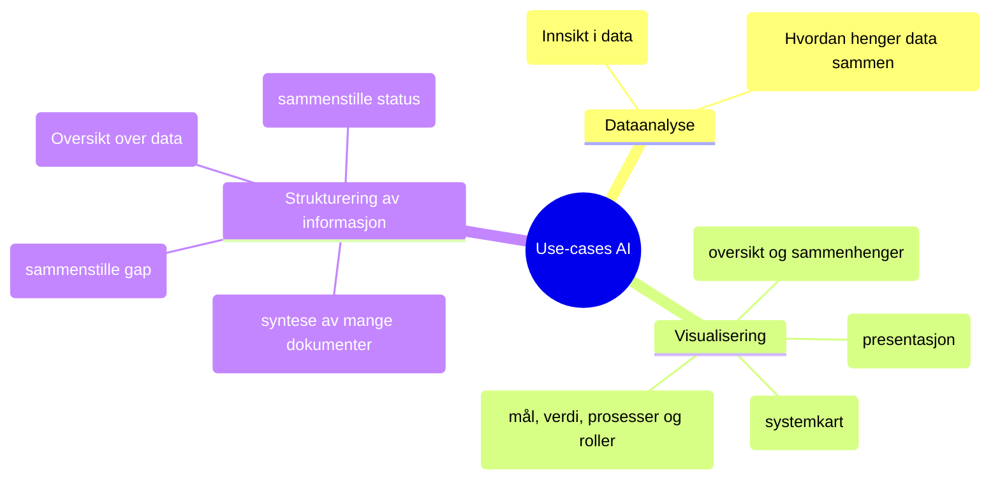

# AI som verktøy for virksomhetsarkitektur

Repository for å teste hvordan Helsedirektoratet kan benytte AI som verktøy i sitt arbeid med virksomhetsarkitektur for helsesektoren. Repository fungerer som dokumentasjon av ulike måter vi kan ta i bruk AI for å understøtte arkitekturarbeidet.

## Eksempel

- [Skills og spesialistagenter](SKILLS-OG-AGENTER.md) – Oversikt over prosjektspesifikke skills og agenter for utredningsarbeid med Claude Code

## Use cases

Use-cases for AI innen arkitektur.

- Dataanalyse - av mange datakilder i henhold til problemstilinger som er viktig for å avklare mål og kapabiliter
- Visualisering av arkitekturartefakter for å vise sammenhenger som er vanskelig å få oversikt over som tekst, diagrammer og modeller, presentasjoner, prosessflyt og systemkart
- Sammenstilling og strukturering av informasjon - syntese av mange dokumenter, strukturere innspill, sammenstille status og gap
- Rollespill og perspektivtesting - djevelens advokat, opptre som interessent og scenariotesting av varianter og risikovurdering

