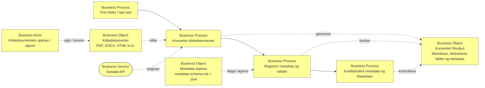

## Prosess for konvertering og metadata

To make input documents more AI friendly it is usefull to convert input documents fraom DOCX, PDF etc to markdown. It can also be useful when maintaining a source repository containing a large document base to include some metadata about provenance of the different documents in the repo. This prosess describe one way to convert requested source documents to Markdown with a script using Datalab converter or Datalab API, retain extracted images in a separate folder for each output Markdown file, and add schema-compliant metadata as frontmatter.

